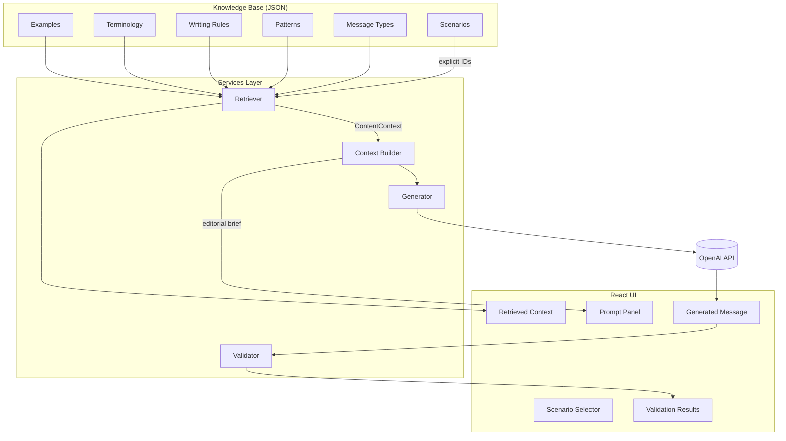

# Content Engineering Playground

A portfolio project that demonstrates how structured editorial knowledge can power consistent, AI-assisted product copy — using password validation as a practical example domain.

**Live demo:** _Add deployment URL here_  
**Stack:** React · TypeScript · Vite · OpenAI · Local JSON knowledge base

---

## Overview

Most teams treat AI copy generation as a prompt-writing problem. This project treats it as a **content engineering** problem.

Instead of asking a model to "write a good error message" and hoping for the best, the playground shows how product copy can be assembled from reusable editorial assets — message types, patterns, writing rules, terminology, and approved examples — then passed to an LLM as a structured brief.

The result is a transparent workflow: you can see exactly what knowledge was retrieved, what prompt was sent, and what the model returned. A lightweight validator then checks the output against editorial constraints.

This is not a production tool. It is an educational prototype designed to show how content designers and engineers can collaborate on AI-ready content systems.

---

## Problem

Password validation UX is deceptively simple. A product might need dozens of inline error messages — missing uppercase, too short, already used — each with slightly different user intent, tone, and structure.

Without a system, teams typically face one of two outcomes:

1. **Inconsistent copy** — every message is written ad hoc, with different voice, terminology, and level of detail.
2. **Fragile AI prompts** — a single mega-prompt tries to encode all rules at once, becomes unmaintainable, and produces unpredictable output.

Neither scales. As scenarios multiply, editorial debt compounds. Writers cannot audit what the AI was told. Engineers cannot trace why a message changed.

---

## Why Content Engineering

**Content engineering** applies structured, reusable models to product copy — the same way we model data, components, or API contracts.

The core idea is separation of concerns:

| Layer | Responsibility |
|-------|------------------|
| **Editorial knowledge** | What to say, how to say it, and what to avoid |
| **Retrieval** | Which knowledge applies to a given situation |
| **Prompt building** | Translating knowledge into model-ready guidance |
| **Generation** | Producing copy from the brief |
| **Validation** | Checking output against editorial rules |

This mirrors how design systems work for UI: shared primitives, composed for specific contexts. A button component is not redesigned from scratch every time; neither should an error message be.

For hiring managers and recruiters, this project demonstrates:

- **Content design thinking** — voice, tone, terminology, and message architecture
- **Systems thinking** — reusable assets, explicit relationships, no hidden magic
- **AI literacy** — prompts as editorial briefs, not black-box incantations
- **Frontend engineering** — TypeScript, React, clear service boundaries

---

## Content Model

The knowledge base is a graph of editorial assets connected by explicit IDs. The **scenario** is the entry point — it describes a user situation and references everything else.

```
Scenario
  ├── messageType      → editorial category (e.g. recoverable error)
  ├── patterns[]       → message structure (e.g. action first)
  ├── writingRules[]   → style constraints (e.g. active voice)
  ├── terminology[]    → preferred and avoided terms
  └── examples[]       → approved reference copy
```

### Asset types

| Type | Purpose | Example |
|------|---------|---------|
| **Scenario** | Describes when copy appears and what the user needs | Missing uppercase letter |
| **Message Type** | Defines purpose, tone, and expected outcome | Recoverable Error |
| **Pattern** | Defines message structure and shape | Action First |
| **Writing Rule** | Encodes a style constraint with rationale | One Issue, Active Voice |
| **Terminology** | Specifies preferred language and words to avoid | "uppercase letter" not "capital letter" |
| **Example** | Shows approved copy and explains why it works | "Add an uppercase letter." |

Each asset is stored as a JSON file and typed in TypeScript. Scenarios **compose** shared assets rather than duplicating content — nine scenarios share the same message type, pattern, and writing rules; only terminology and examples change.

---

## AI Workflow

The application walks through four stages, each visible in the UI:

```
1. Select Scenario
       ↓
2. Retrieve Context        ← load linked editorial assets by ID
       ↓
3. Build Prompt            ← transform context into an editorial brief
       ↓
4. Generate Message        ← send brief to OpenAI, display result
       ↓
5. Validate (demo)         ← check output against editorial heuristics
```

**Retrieval** follows explicit relationships only. No text matching, no inference. If a scenario references `action-first`, the retriever loads that pattern by ID.

**Prompt building** converts structured data into prose — a brief that reads like guidance from a senior content designer, not a JSON dump.

**Generation** sends the brief to the OpenAI Chat Completions API and returns a single message string.

**Validation** (demonstration only) applies lightweight heuristics: preferred terminology present, avoided terms absent, active voice detected, message under 80 characters.

---

## Architecture Diagram



### Project structure

```
content-engineering-playground/
├── assets/                    # Editorial knowledge base (JSON)
│   ├── scenarios/             # 10 password validation scenarios
│   ├── message-types/         # Reusable message categories
│   ├── patterns/              # Message structure templates
│   ├── writing-rules/         # Style and voice rules
│   ├── terminology/           # Glossary entries
│   └── examples/              # Approved reference copy
│
├── src/
│   ├── components/            # UI (selector, context cards, prompt, output)
│   ├── services/
│   │   ├── retriever.ts       # Assembles ContentContext from scenario ID
│   │   ├── contextBuilder.ts  # Builds editorial brief for the LLM
│   │   ├── generator.ts       # Calls OpenAI Chat Completions API
│   │   └── validator.ts       # Demo validation heuristics
│   └── types/                 # TypeScript interfaces for all assets
│
└── package.json
```

---

## Knowledge Base

The password validation domain includes **10 scenarios** built from **shared editorial assets**:

### Scenarios

| Scenario | Message Type | Pattern |
|----------|--------------|---------|
| Missing uppercase | Recoverable Error | Action First |
| Missing lowercase | Recoverable Error | Action First |
| Missing number | Recoverable Error | Action First |
| Missing special character | Recoverable Error | Action First |
| Password too short | Recoverable Error | Action First |
| Password too long | Recoverable Error | Action First |
| Passwords don't match | Recoverable Error | Problem Solution |
| Password already used | Blocking Error | Problem Solution |
| Password too weak | Recoverable Error | Action First |
| Password contains spaces | Recoverable Error | Action First |

### Shared assets (defined once, reused many times)

- **Message types:** `recoverable-error`, `blocking-error`, `success`
- **Patterns:** `action-first`, `problem-solution`, `confirmation`
- **Writing rules:** `active-voice`, `one-issue`, `sentence-case`, `avoid-blame`, `concise`, `plain-language`
- **Terminology:** `password`, `uppercase-letter`, `lowercase-letter`, `number`, `special-character`

Adding a new scenario means writing one JSON file that references existing assets — not rewriting the entire prompt.

---

## Example Flow

**Scenario:** Missing Uppercase Letter

**1. Retrieve Context**

The retriever loads the scenario and resolves its references:

- Message Type → Recoverable Error
- Pattern → Action First
- Writing Rules → active voice, one issue, sentence case, avoid blame, concise, plain language
- Terminology → password, uppercase letter
- Example → "Add an uppercase letter."

**2. Build Prompt**

The context builder produces an editorial brief:

```
Scenario
The password does not contain an uppercase letter.

User Goal
Create a password that meets the uppercase requirement.

Message Type
Recoverable Error

Pattern
Action First — Start with the action the user should take...

Writing Rules
- Write direct instructions where the user is the actor.
- Each message should communicate only one problem.
...

Terminology
Use "uppercase letter" (a letter from A to Z). Do not use "capital letter"...

Approved Examples
"Add an uppercase letter." — Starts with a direct action...

Task
Write one clear inline error message.
```

**3. Generate & Validate**

OpenAI returns a message such as *"Add an uppercase letter."* The demo validator checks terminology, voice, and length — surfacing pass/fail results in the UI.

---

## Future Improvements

This prototype intentionally stays small. Natural next steps for a production-oriented version:

- **Headless CMS integration** — manage editorial assets in Contentful, Sanity, or a git-based CMS instead of local JSON
- **Server-side API route** — keep the OpenAI key off the client and add rate limiting
- **Richer validation** — NLP-based checks, terminology linting, readability scoring
- **Human-in-the-loop review** — approve, edit, or reject generated copy before publish
- **Multi-domain support** — extend beyond password validation to onboarding, billing, or empty states
- **Analytics** — track which rules fail most often to improve the knowledge base
- **Success flows** — wire up the `success` message type and `confirmation` pattern for confirmation copy

---

## Getting Started

### Prerequisites

- Node.js 18+
- An OpenAI API key

### Setup

```bash
git clone https://github.com/Urmi2910/content-engineering-playground.git
cd content-engineering-playground
npm install
cp .env.example .env
```

Add your API key to `.env`:

```
VITE_OPENAI_API_KEY=your_api_key
```

### Run

```bash
npm run dev
```

Open [http://localhost:5173](http://localhost:5173), select a scenario, and click **Retrieve Context** to walk through the full workflow.

| Command | Description |
|---------|-------------|
| `npm run dev` | Start development server |
| `npm run build` | Production build |
| `npm run preview` | Preview production build |
| `npm run lint` | Run Oxlint |

---

## Author

Built as a portfolio project exploring the intersection of **content design**, **structured content**, and **AI-assisted UX writing**.

Questions or feedback? Open an issue or reach out via [GitHub](https://github.com/Urmi2910).
